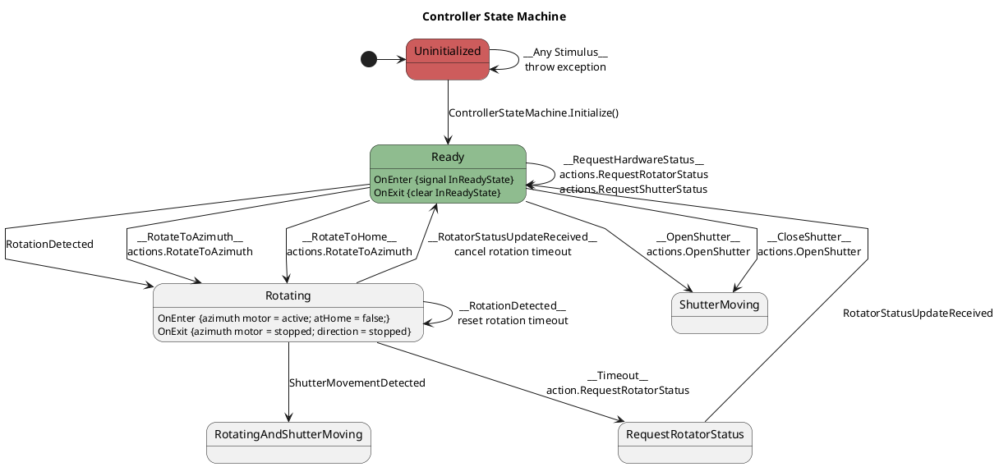

```puml
@startuml
skinparam linetype polyline
skinparam state {
    BackgroundColor<<Warning>> IndianRed
    BackgroundColor<<Safe>> DarkSeaGreen
}
Hide empty
Title Controller State Machine

[*] -> Uninitialized 

state Uninitialized <<Warning>>
Uninitialized --> Uninitialized : __Any Stimulus__\nthrow exception
Uninitialized --> Ready : ControllerStateMachine.Initialize()

state Ready <<Safe>>
Ready --> Ready : __RequestHardwareStatus__\nactions.RequestRotatorStatus\nactions.RequestShutterStatus
Ready --> Rotating : RotationDetected
Ready --> Rotating : __RotateToAzimuth__\nactions.RotateToAzimuth
Ready --> Rotating : __RotateToHome__\nactions.RotateToAzimuth
Ready --> ShutterMoving : __OpenShutter__\nactions.OpenShutter
Ready --> ShutterMoving : __CloseShutter__\nactions.OpenShutter
Ready: OnEnter {signal InReadyState}
Ready: OnExit {clear InReadyState}

state Rotating
Rotating --> Ready : __RotatorStatusUpdateReceived__\ncancel rotation timeout
Rotating: OnEnter {azimuth motor = active; atHome = false;}
Rotating: OnExit {azimuth motor = stopped; direction = stopped}
Rotating --> Rotating : __RotationDetected__\nreset rotation timeout
Rotating --> RotatingAndShutterMoving : ShutterMovementDetected
Rotating --> RequestRotatorStatus : __Timeout__\naction.RequestRotatorStatus


state RequestRotatorStatus
RequestRotatorStatus --> Ready : RotatorStatusUpdateReceived

@enduml
```