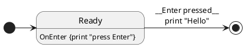

# ASCOM Server for NexDome

## Software Design UML Diagrams

### Controller State Machines

#### About Finite State Machines

[_Finite State Machines_][FSM] (FSMs) can be used in software to model the behaviour of an event-driven system over time. The system is modeled as a finite set of predetermined states. The system is always in exactly one _state_ and remains in that state until some _trigger event_ causes a _state transition_. In UML state diagrams, states are represented by boxes. Inside the boxes are descriptions of any _actions_ that occur when entering or exiting the state. _Transitions_ are represented by directed lines or arcs. The transition is labelled with the __trigger event__ (usually underlined) that would trigger the transition. Anything below the underlined trigger event are actions that are executed prior to completing the transition. So in the following example, we would start by immediately transitioning to the `Ready` state, which woudl cause "Press Enter" to be printed. The system would then remain in the `Ready` state until triggered by <kbd>Enter</kbd> being pressed, which would cause "Hello" to be printed out and make a transition to the `Stop` state, at which point no further actions are possible. `Start` and `Stop` are special states don't really exist but serve to label the entry point and (optionally) exit point of the state machine.

FSMs are a very powerfull design tool for real-time systems and can be relatively easily implemented in code. We have taken a fairly simple bespoke approach with directly coded actions and transition logic. Common state data is stored in the `ControllerStateMachine` class and a reference to this object is passed to each state as it is created. We have used two separate statemachines to model behaviour of the rotator and shutter, each of which operates independently of the other in hardware. State classes derive from `ShutterStateBase` or `RotatorStateBase` and follow the [State design pattern][StatePattern].

States may reach out into the `ControllerStateMachine` class and mutate the shared state at any time. `ControllerStateMachine` implements the `INotifyPropertyChanged` interface and this acts as a [_View Model_][MVVM] for the user interface.

#### Rotator State Transition Logic
@import "RotatorStateMachine.md"

#### Shutter State Transition Logic
@import "ShutterStateMachine.md"

#### State Machine Classes
@import "StateMachineClasses.md"

[FSM]: https://en.wikipedia.org/wiki/Finite-state_machine "Wikipedia: Finite State Machines"
[StatePattern]: https://en.wikipedia.org/wiki/State_pattern "Wikipedia: State design pattern"
[MVVM]: https://en.wikipedia.org/wiki/Model%E2%80%93view%E2%80%93viewmodel "Wikipedia: Model-View-View Model design pattern"