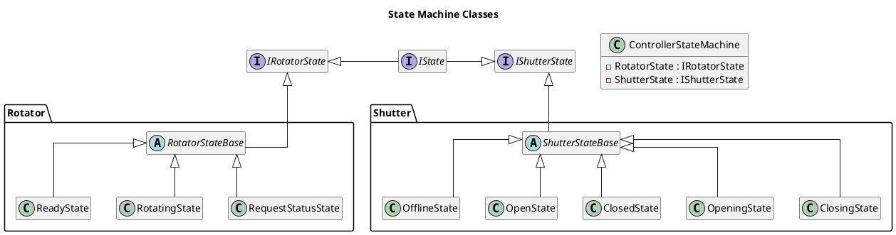

```puml
@startuml
Title State Machine Classes
Hide empty members
skinparam linetype ortho

interface IState
interface IRotatorState
interface IShutterState

IRotatorState <|-r- IState
IShutterState <|-l- IState

class ControllerStateMachine {
    -RotatorState : IRotatorState
    -ShutterState : IShutterState
}

namespace Rotator {
abstract class RotatorStateBase
.IRotatorState <|-- RotatorStateBase
RotatorStateBase <|-- ReadyState
RotatorStateBase <|-- RotatingState
RotatorStateBase <|-- RequestStatusState
}

namespace Shutter {
abstract class ShutterStateBase
.IShutterState <|-- ShutterStateBase
ShutterStateBase <|-- OfflineState
ShutterStateBase <|-- OpenState
ShutterStateBase <|-- ClosedState
ShutterStateBase <|-- OpeningState
ShutterStateBase <|-- ClosingState
}
@enduml

```